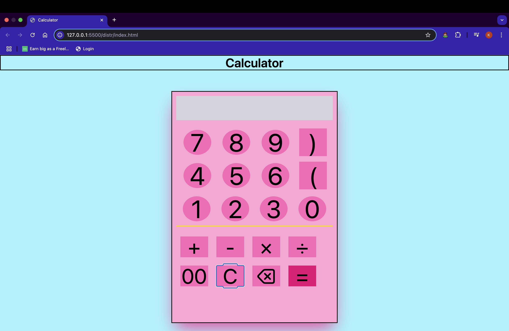

# 🔢 Calculator App

A clean and responsive calculator built using **HTML**, **Tailwind CSS**, and **JavaScript**.  
This simple project demonstrates core web development skills like DOM manipulation, styling with Tailwind, and interactive UI design.

---

## 🚀 Features

- ✅ Perform basic arithmetic: **addition, subtraction, multiplication, division**
- ✅ Clear screen with **C** button
- ✅ Delete last input with **⌫** button
- ✅ Real-time expression display
- ✅ Responsive layout using Tailwind CSS
- ✅ Basic error handling on invalid expressions

---

## 🖥️ Technologies Used

- **HTML**
- **Tailwind CSS**
- **Vanilla JavaScript**

---

## 📸 Preview

